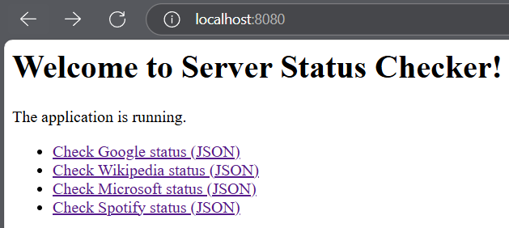
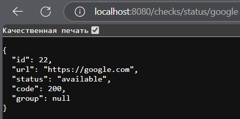

# Server Status Checker

Spring Boot сервис для проверки статуса сайтов (JSON) и управления группами серверов. Есть кеширование HTML-страниц для ускорения работы.

**Запуск:**
1. Настройте БД в `application.properties`
2. Запустите:
   ```sh
   mvn clean spring-boot:run
   ```
Лабораторная работа №3

**Примеры:**
- `/checks/status/google`
- `/checks/status/wikipedia`
- `/checks/status/microsoft`
- `/checks/status/spotify`

## Скриншоты


